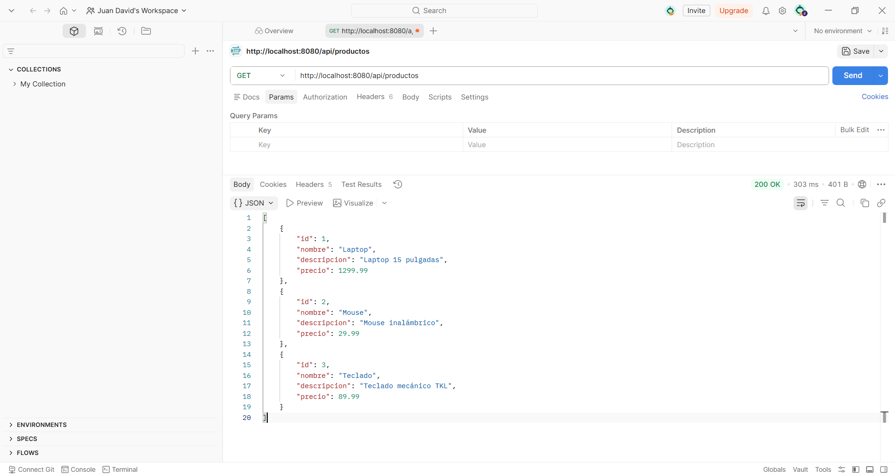
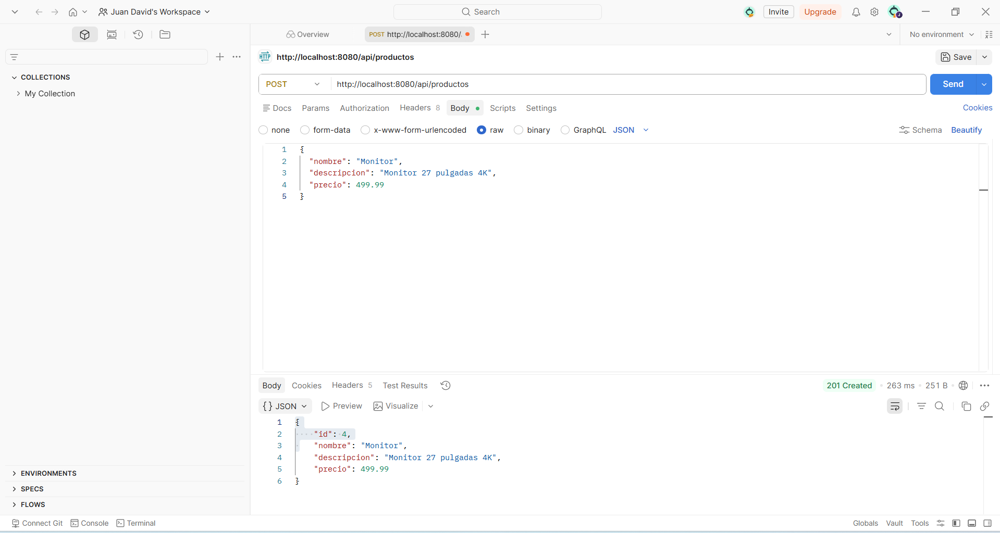
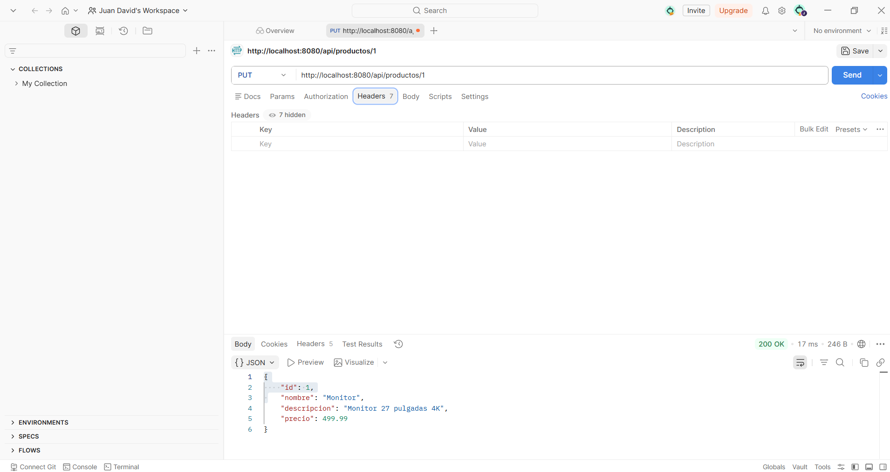
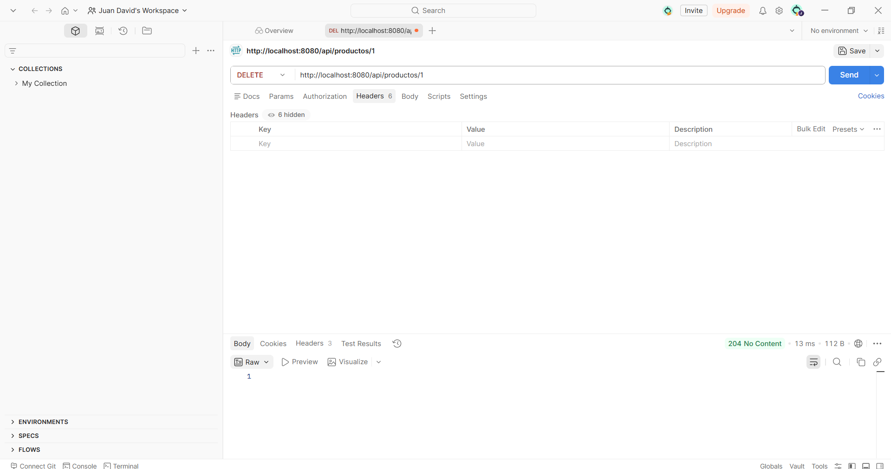

# Laboratorio Unidad 7 - Post-Contenido 2

## API REST CRUD con Spring Boot

## Descripción del proyecto

Este proyecto corresponde al laboratorio de Programación Web de la Unidad 7, Post-Contenido 2.

La aplicación consiste en una API REST desarrollada con Spring Boot que permite gestionar productos mediante operaciones CRUD. A través de la API se pueden listar, consultar, crear, actualizar y eliminar productos usando los métodos HTTP GET, POST, PUT y DELETE.

Los productos se almacenan temporalmente en memoria y las respuestas se entregan en formato JSON. Además, la API utiliza códigos HTTP adecuados para cada operación, como 200 OK, 201 Created, 204 No Content y 404 Not Found.

---

## Instrucciones de ejecución

Para ejecutar el proyecto, se debe tener instalado Java 17 o superior, Maven y Git.

Primero, clone el repositorio desde GitHub:

```bash
git https://github.com/juandavid202021/pulido-post2-u7.git
```

Luego ingrese a la carpeta del repositorio:

```bash
cd pulido-post2-u7
```

Después ingrese a la carpeta del proyecto:

```bash
cd api-productos
```

Finalmente, ejecute el proyecto con Maven:

```bash
mvn spring-boot:run
```

Cuando la aplicación inicie correctamente, en la consola debe aparecer un mensaje similar a:

```text
Started ApiProductosApplication
```

Después, la API puede probarse desde el navegador o desde Postman usando la siguiente URL:

```text
http://localhost:8080/api/productos
```

---

## Respuestas REST probadas

### GET - Listar productos

Método:

```text
GET
```

URL:

```text
http://localhost:8080/api/productos
```

Respuesta esperada:

```text
200 OK
```

---

### GET - Consultar producto por ID

Método:

```text
GET
```

URL:

```text
http://localhost:8080/api/productos/1
```

Respuesta esperada:

```text
200 OK
```

---

### POST - Crear producto

Método:

```text
POST
```

URL:

```text
http://localhost:8080/api/productos
```

Body en formato JSON:

```json
{
  "nombre": "Monitor",
  "descripcion": "Monitor 27 pulgadas 4K",
  "precio": 499.99
}
```

Respuesta esperada:

```text
201 Created
```

---

### PUT - Actualizar producto

Método:

```text
PUT
```

URL:

```text
http://localhost:8080/api/productos/4
```

Body en formato JSON:

```json
{
  "nombre": "Monitor Curvo",
  "descripcion": "Monitor curvo 32 pulgadas QHD",
  "precio": 699.99
}
```

Respuesta esperada:

```text
200 OK
```

---

### DELETE - Eliminar producto

Método:

```text
DELETE
```

URL:

```text
http://localhost:8080/api/productos/4
```

Respuesta esperada:

```text
204 No Content
```

---

### GET - Producto inexistente

Método:

```text
GET
```

URL:

```text
http://localhost:8080/api/productos/999
```

Respuesta esperada:

```text
404 Not Found
```

Ejemplo de respuesta:

```json
{
  "error": "Producto no encontrado: 999"
}
```

---

## Capturas de pantalla de respuestas REST

### GET - Listar productos



### GET - Producto por ID


### POST - Crear producto



### PUT - Actualizar producto



### DELETE - Eliminar producto


